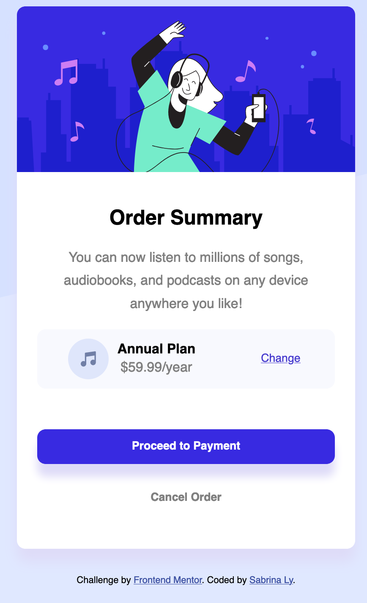
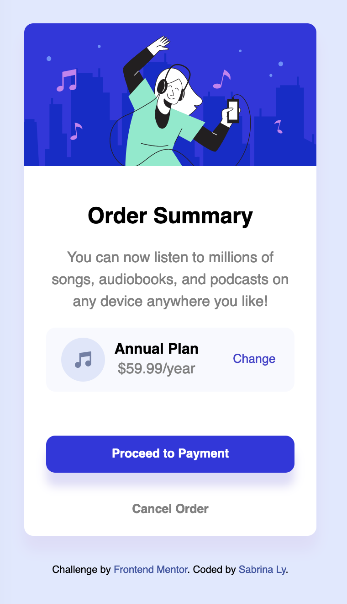

# Frontend Mentor - Order summary card solution

This is a solution to the [Order summary card challenge on Frontend Mentor](https://www.frontendmentor.io/challenges/order-summary-component-QlPmajDUj). Frontend Mentor challenges help you improve your coding skills by building realistic projects.

## Table of contents

- [Overview](#overview)
  - [The challenge](#the-challenge)
  - [Screenshot](#screenshot)
  - [Links](#links)
- [My process](#my-process)
  - [Built with](#built-with)
  - [What I learned](#what-i-learned)
  - [Continued development](#continued-development)
  - [Useful resources](#useful-resources)
- [Author](#author)
- [Acknowledgments](#acknowledgments)

**Note: Delete this note and update the table of contents based on what sections you keep.**

## Overview

### The challenge

In this challenge, a order summary card is to be replicated. The purpose of this challenge was to practice Flexbox and continue improving on my basic CSS.

Users should be able to:

- See hover states for interactive elements

### Screenshots

| Desktop View                                                            | Mobile View                                                          |
| ----------------------------------------------------------------------- | -------------------------------------------------------------------- |
|  |  |
|  |

_Desktop View & Mobile View_

The Desktop View is more wider compared to the Mobile view. Slight modifications were done to the mobile version. The main differences were adjusting the width and height of the order summary container.

Overall, the desktop and mobile view should be nearly identical for similar experience.

### Links

- Solution URL: [Add solution URL here](https://your-solution-url.com)
- Live Site URL: [Add live site URL here](https://your-live-site-url.com)

## My process

### Built with

- Semantic HTML5 markup
- CSS custom properties
- Flexbox

### What I learned

#### Flexbox

The main purpose of this challenge was to practice CSS layouts - specifically flexbox. In this challenge, I use flexbox multiple times for structuring the layout. Example is:

```css
body {
  background-color: hsl(225, 100%, 94%);
  background-image: url("./images/pattern-background-desktop.svg");
  background-repeat: no-repeat;

  background-size: contain;
  display: flex;
  justify-content: center;
  align-items: center;
  flex-direction: column;
  min-height: 100vh;
  row-gap: 2em;
}
```


In this CSS code block, I used flexbox on the `<body>` because I wanted the `<div>` child element inside the body to be centered vertically and horizontally. This is accomplished from the `justify-content` and `align-items`. By using justify-content, it will center the flex-items by the main axis (in this case vertical due to setting flex-direction to column). While, align-items will center by the cross axis (iin this case horizontal).

Another major usage of flexbox is in this code:
```html
<div class="plan">
          <div class="group-1">
            

            <div class="plan-info">
              <p>Annual Plan</p>
              <p>$59.99/year</p>
            </div>
          </div>

          <button class="change">Change</button>
        </div>
      </div>
```
```css
.plan{
    display: flex;
    justify-content: space-around;
    align-items: center;
    background-color: #f8f9fe;
    border-radius: 10px;
}

.group-1{
    display: flex;
    column-gap: 10px;
    
}
```
In the above code, I updated my HTML code such that I group the music icon and annual plan price into a container. This is due to issues on grouping the first two flex-items together. Attempts were made with flex-grow but grouping together as a container resovled the issue.

Furthermore, shown in the code, is a flexbox within a flexbox. The flexbox on the class plan, is used to layout the music icon, pricing and button. Then the group-1 class has a flexbox to layout the music icon and button. I needed flexbox as the `````` and ```<div>``` were inline and block elements respectively. It's easier to jsut use flexbox than change their display type.
 
### Continued development
Currently, I am satsified with the end-result. Some issues I want to improve on are media-queries and measurement units. I am using units such as rem and em but I have not fully grasp these concepts yet. 

This challenge has helped me put into practice flexbox and css layouts but I will still need to further develop my CSS skills.

### Useful resources
- [A Complete Guide to Flexbox](https://css-tricks.com/snippets/css/a-guide-to-flexbox/) - Has helped me understand the basic properties of flexbox and serve as a reference

- [Mozilla Flexbox Tutorial](https://developer.mozilla.org/en-US/docs/Learn/CSS/CSS_layout/Flexbox) - A good introuction to learning flexbox with simple practice questions


## Author

- Frontend Mentor - [@LySabrina](hhttps://www.frontendmentor.io/profile/LySabrina)


## Acknowledgments

Thanks for Frontend Mentor for this CSS practice! :)